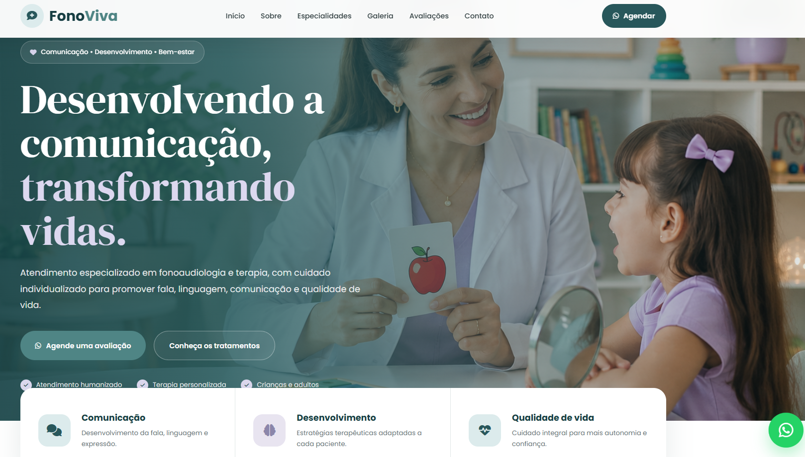

## 👨‍💻 Autor

Desenvolvido por **Riolly Mikael**.

- **GitHub:** @riollymikael
  
---

# 🗣️ Landing Page — FonoViva | Fonoaudiologia & Terapia

Landing page moderna, acolhedora e totalmente responsiva desenvolvida para clínicas e profissionais de **Fonoaudiologia & Terapia**.

O projeto apresenta uma identidade visual profissional em tons de **verde petróleo, lavanda, creme e branco**, criando uma experiência que transmite acolhimento, confiança, tranquilidade e cuidado.

A página conta com apresentação profissional, especialidades, processo de atendimento, galeria com 7 imagens, avaliações de pacientes, integração com redes sociais e contato direto pelo WhatsApp.

<div align="center">

  <!-- IMAGEM DE PREVIEW -->
  

  <br><br>

  <!-- BOTÃO DE LIVE DEMO -->
  <p align="center">
    <a href="#">
      
    </a>
  </p>

  <!-- BOTÕES -->
  <a href="#">
    
  </a>

  

  

</div>

---

## ✨ Sobre o Projeto

A **FonoViva** foi desenvolvida como uma landing page profissional para apresentação de serviços de fonoaudiologia e acompanhamento terapêutico.

O design foi pensado para transmitir uma imagem moderna e acolhedora, utilizando uma combinação de cores suaves e elementos visuais relacionados à comunicação, desenvolvimento e qualidade de vida.

O projeto pode ser facilmente personalizado para clínicas, consultórios ou profissionais autônomos da área de fonoaudiologia.

---

## 🚀 Funcionalidades

- **Header Fixo (Sticky Header):** menu permanece acessível durante a navegação pela página.

- **Menu Mobile Responsivo:** menu hambúrguer adaptado para smartphones e tablets.

- **Seção Hero:** apresentação principal com chamada para ação e acesso direto ao WhatsApp.

- **Apresentação da Profissional:** área destinada à fonoaudióloga, registro profissional, experiência e diferenciais.

- **Cards de Especialidades:** apresentação organizada dos principais tratamentos e serviços.

- **Etapas do Atendimento:** seção explicando o processo desde o primeiro contato até o acompanhamento da evolução.

- **Galeria Profissional:** área com 7 imagens representando estrutura, atendimentos e recursos terapêuticos.

- **Avaliações:** depoimentos organizados em cards para aumentar a confiança e credibilidade.

- **CTA de Agendamento:** chamada estratégica para incentivar o contato do paciente.

- **WhatsApp Integrado:** diferentes botões de contato distribuídos pela landing page.

- **WhatsApp Flutuante:** botão fixo com animação pulsante para facilitar o agendamento.

- **Instagram:** integração com a rede social através do rodapé.

- **Rodapé Completo:** navegação, contatos, horários de atendimento e redes sociais.

- **Design Responsivo:** interface adaptada para desktop, notebook, tablet e smartphone.

---

## 🩺 Especialidades Apresentadas

A landing page possui áreas preparadas para apresentar diferentes serviços da fonoaudiologia:

- 👶 Fonoaudiologia Infantil
- 💬 Fala e Linguagem
- 👂 Processamento Auditivo
- 🎙️ Terapia de Voz
- 🙂 Motricidade Orofacial
- 👤 Fonoaudiologia Adulta

---

## 🖼️ Galeria

O projeto conta com uma galeria de **7 imagens profissionais**, mantendo a mesma identidade visual da clínica.

### 01 — Consultório

Ambiente moderno, confortável e acolhedor preparado para os atendimentos.

### 02 — Atendimento Infantil

Atendimento fonoaudiológico infantil com atividades lúdicas e recursos terapêuticos.

### 03 — Avaliação Fonoaudiológica

Representação do processo de avaliação e identificação das necessidades individuais do paciente.

### 04 — Fala & Linguagem

Atividades voltadas para estimulação da fala, linguagem, articulação e comunicação.

### 05 — Terapia Vocal

Atendimento direcionado à respiração, projeção, ressonância, articulação e qualidade vocal.

### 06 — Recursos Terapêuticos

Materiais utilizados durante os atendimentos para estimular linguagem, comunicação e desenvolvimento.

### 07 — Comunicação & Qualidade de Vida

Representação da comunicação como ferramenta para autonomia, confiança, conexão e qualidade de vida.

---

## 🎨 Identidade Visual

A interface utiliza uma paleta de cores pensada para transmitir tranquilidade, confiança e acolhimento.

```css
--primary: #4f8585;
--primary-dark: #28575b;
--primary-deep: #173e43;

--secondary: #8b86aa;
--secondary-light: #e8e4f0;

--aqua-light: #dcebec;

--cream: #f8f6f1;
--white: #ffffff;
```

### Tipografia

O projeto utiliza duas famílias tipográficas:

- **DM Serif Display** — títulos e elementos de destaque.
- **Poppins** — textos, botões, navegação e informações.

A combinação cria contraste entre elegância e legibilidade.

---

## 🛠️ Tecnologias Utilizadas

- **HTML5:** estrutura semântica da landing page.
- **CSS3:** estilização, Grid, Flexbox, animações e responsividade.
- **JavaScript (ES6):** funcionamento do menu mobile e interações da interface.
- **Font Awesome:** ícones utilizados em diferentes áreas do site.
- **Google Fonts:** carregamento das fontes Poppins e DM Serif Display.
- **WhatsApp API:** links diretos para contato e agendamento.

---

## 📱 Responsividade

A landing page foi desenvolvida para funcionar em diferentes tamanhos de tela.

### 💻 Desktop

Layout completo com grids, galeria expandida e navegação horizontal.

### 📟 Tablet

Reorganização automática das colunas e elementos da interface.

### 📱 Smartphone

Layout em coluna única, menu hambúrguer, botões adaptados e imagens redimensionadas.

### 📱 Smartphones pequenos

Ajustes adicionais para telas com largura inferior a 420px.

---

## 📂 Estrutura do Projeto

```text
landing-fonoaudiologia/
│
├── index.html
├── style.css
├── script.js
├── README.md
│
└── assets/
    │
    ├── preview.png
    │
    ├── hero-fono.jpg
    ├── profissional.jpg
    │
    ├── galeria-1.jpg
    ├── galeria-2.jpg
    ├── galeria-3.jpg
    ├── galeria-4.jpg
    ├── galeria-5.jpg
    ├── galeria-6.jpg
    └── galeria-7.jpg
```

---

## 🖼️ Arquivos de Imagem

| Arquivo | Utilização |
|---|---|
| `preview.png` | Preview completo do projeto no GitHub |
| `hero-fono.jpg` | Imagem principal da seção Hero |
| `profissional.jpg` | Apresentação da fonoaudióloga |
| `galeria-1.jpg` | Consultório |
| `galeria-2.jpg` | Atendimento infantil |
| `galeria-3.jpg` | Avaliação fonoaudiológica |
| `galeria-4.jpg` | Fala e linguagem |
| `galeria-5.jpg` | Terapia vocal |
| `galeria-6.jpg` | Recursos terapêuticos |
| `galeria-7.jpg` | Comunicação e qualidade de vida |

---

## 💬 Integração com WhatsApp

A landing page possui diferentes chamadas para contato através do WhatsApp.

O botão flutuante permanece disponível durante toda a navegação e utiliza uma animação de pulso para chamar a atenção do visitante.

Para utilizar o projeto com um número real, basta substituir o número demonstrativo presente no código:

```text
5500000000000
```

pelo WhatsApp do profissional ou da clínica.

---

## 🌐 Publicação

Por ser uma landing page construída utilizando HTML, CSS e JavaScript, o projeto pode ser hospedado facilmente em serviços de hospedagem de sites estáticos.

O projeto também pode ser integrado a um domínio personalizado, como:

```text
www.fonoviva.com.br
```

---


## 📄 Licença

Este projeto foi desenvolvido para fins de portfólio, demonstração e desenvolvimento de landing pages profissionais.

---

<div align="center">

### 💜 FonoViva

**Comunicação • Desenvolvimento • Bem-estar**

<br>

Desenvolvido com dedicação por **Riolly**

</div>
